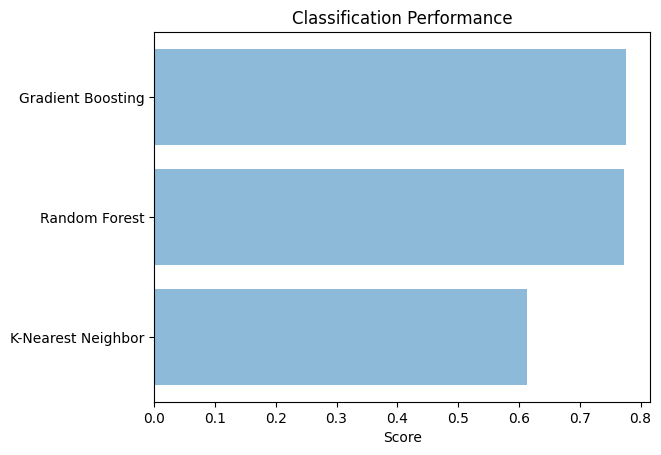

# Laporan Proyek Home Loan Approval Prediction - Iva Raudyatuzzahra

## Project Overview

Proyek ini bertujuan untuk mengembangkan model _machine learning_ yang dapat memprediksi dengan akurat apakah aplikasi pinjaman untuk hipotek rumah harus disetujui atau ditolak berdasarkan berbagai fitur terkait pemohon dan properti.

### Domain Proyek
Proyek ini dapat membantu lembaga keuangan dengan cara memprediksi kelayakan pemohon berdasarkan data yang di-_submit_ dan dibandingkan dengan database pemohon sebelumnya. Dengan menerapkan otomatisasi proses pengecekan kelayakan, proses persetujuan pinjaman akan menjadi jauh lebih cepat. Selain itu, penggunaan _machine learning_ juga dapat meminimalisir ketidakakuratan hasil pengecekan sehingga dapat mengurangi risiko fraud maupun menghindari lolosnya calon peminjam yang berpotensi gagal membayar pinjaman.

## Business Understanding

Lembaga pemberi pinjaman, seperti bank dan koperasi kredit, menerima banyak aplikasi pinjaman rumah setiap harinya. Menilai setiap aplikasi secara manual dapat memakan waktu dan rentan terhadap bias manusia. Dengan memanfaatkan machine learning, kita dapat membuat sistem otomatis yang menilai aplikasi pinjaman dengan lebih efisien dan objektif.

Bagian laporan ini mencakup:

### Problem Statements

- Bagaimanakah cara mempercepat waktu pengecekan kelayakan pinjaman?
- Bagaimanakah cara memperoleh hasil prediksi yang akurat?

### Goals

- Proses penegecekan di bawah 5 menit
- Akurasi model minimal 75%

    ### Solution statements
    - Untuk mempercepat pengecekan dapat dilakukan dengan mengotomatisasi proses tersebut menggunakan _machine learning_
    - Untuk memaksimalkan akurasi, dapat dilakukan dengan melakukan _data cleaning_ seperti mengatasi _missing values_, memilih model dan memilih parameter yang optimal.

## Data Understanding
Proyek ini menggunakan dataset Home Loan Approval di India. Informasi mengenai dataset ini adalah sebagai berikut:

- Dataset memiliki format CSV (Comma-Seperated Values).
- Dataset memiliki 614 sample dan 13 fitur.
- Dataset memiliki 8 fitur bertipe object, 4 fitur bertipe float64 dan 1 fitur bertipe int64.
- Terdapat _missing values_ dalam dataset.
- Sebanyak 422 atau 68.7% sample diterima pengajuannya

Sumber: [Kaggle](https://www.kaggle.com/datasets/rishikeshkonapure/home-loan-approval/code).
 
Variabel-variabel pada dataset ini adalah sebagai berikut:
- Loan_ID : merupakan nomor identitas pengajuan
- Gender : merupakan jenis kelamin pihak yang melakukan pengajuan
- Married : merupakan status perkawinan pihak yang melakukan pengajuan
- Dependents : merupakan jumlah tanggungan pihak yang melakukan pengajuan, terdiri dari 4 kategori yaitu tidak punya, memimiliki 1 tanggungan, 2 tanggungan, dan memiliki tanggungan lebih dari 3
- Education : merupakan tingkat pendidikan pihak yang melakukan pengajuan
- Self_Employed : merupakan jenis pekerjaan pihak yang melakukan pengajuan apakah berwirausaha atau tidak
- ApplicantIncome : merupakan penghasilan pihak yang melakukan pengajuan
- CoapplicantIncome : merupakan pengahasilan pasangan dari pihak yang melakukan pengajuan
- LoanAmount : merupakan jumlah pinjaman yang diajukan
- Loan_Amount_Term : merupakan lamanya pinjaman
- Credit_History : merupakan status riwayat pinjaman sebelumnya
- Property_Area : merupakan wilayah perumahan yang akan dibeli
- Loan_Status : merupakan status pengajuan pinjaman

## Data Preparation
1. Menghapus fitur yang tidak diperlukan yaitu Loan_ID menggunakan drop() method. Langkah ini dilakukan untuk meningkatkan kualitas data dengan meniadakan fitur yang tidak relevan.

2. Mengecek _missing value_ menggunakan isnull() method. Hasilnya adalah sebagai berikut:
- Terdapat 13 _missing value_ pada kolom _Gender_
- Terdapat 3 _missing value_ pada kolom _Married_
- Terdapat 15 _missing value_ pada kolom _Dependents_
- Terdapat 32 _missing value_ pada kolom _Self_Employed_
- Terdapat 22 _missing value_ pada kolom _LoanAmount_
- Terdapat 14 _missing value_ pada kolom _Loan_Amount_Term_
- Terdapat 50 _missing value_ pada kolom _Credit_History_

3. Menangani missing value. Terdapat beberapa perlakuan yang dapat dilakuakn untuk mengatasi ketiadaan data, yaitu:
- membuang data (baris atau kolom) yang mengandung _missing value_ didalamnya
- Mengisi data yang hilang tersebut dengan data tertentu yang dianggap mendekati. Pengisian data (Imputation) dapat menggunakan nilai rata-rata untuk fitur numerik atau menggunakan modus data (data yang memiliki frekuensi muncul terbanyak).

Pada proyek ini, _missing value_ di-_impute_ nilai baru yaitu menggunakan modus data, dan nilai rata-rata untu fitur LoanAmount. Hal ini dilakukan karena jumlah data yang sedikit sehingga tidak memungkinkan untuk menghapus data yang mengandung missing value. Tahap ini dilakukan untuk meningkatkan kualitas data.

4. Encoding categorical data merupakan proses konversi data kategorikal dalam format _strings_ atau _object_ ke dalam format _integer_, fitur yang diubah meliputi gender, married, education, self_employed, dependents, credit_history, property_area. Tahap ini dilakukan untuk meningkatkan performa model karena algoritma _machine learning_ hanya dapat bekerja dengan data numerik.

5. Train Test Split, bertujuan untuk membagi dataset menjadi data latih dan data uji sehingga proses validasi model yang sudah dilatih dapat menggunakan data baru yang berbeda dengan data latih. _Split ratio yang digunakan dalam proyek ini yaitu 80:20 dimana 80% dataset akan menjadi data latih dan 20% lainnya menjadi data uji.

## _Modelling_
Proyek ini menggunakan 3 model yaitu:
1. _K-Nearest Neighbour_, bekerja dengan membandingkan jarak satu sampel ke sampel pelatihan lain dengan memilih sejumlah k tetangga terdekat. Proyek ini menggunakan _KNeighborsClassifier_ dengan memasukkan X_train dan y_train dalam membangun model. Parameter yang digunakan adalah:
|  **Parameter**  |  **Value**  |
|:---------------:|:-----------:|
| 'algorithm'     | 'auto'      |
| 'leaf_size'     | 30          |
| 'metric'        | 'minkowski' |
| 'metric_params' | None        |
| 'n_jobs'        | None        |
| 'n_neighbors'   | 5           |
| 'p'             | 2           |
| 'weights'       | 'uniform'   |

2. _Random Forest_ adalah teknik dalam _machine learning_ dengan metode ensemble. Teknik ini beroperasi dengan membangun banyak _decision tree_ pada waktu pelatihan. Proyek ini menggunakan _RandomForestClassifier_ dengan memasukkan X_train dan y_train dalam membangun model. Parameter yang digunakan adalah:
|        **Parameter**        | **Value** |
|:---------------------------:|:---------:|
| 'bootstrap'                 | True      |
| 'ccp_alpha'                 | 0.0       |
| 'class_weight'              | None      |
| 'criterion'                 | 'gini'    |
| 'max_depth'                 | None      |
| 'max_features'              | 'sqrt'    |
| 'max_leaf_nodes'            | None      |
| 'max_samples'               | None      |
| 'min_impurity_decrease'     | 0.0       |
| 'min_samples_leaf'          | 1         |
| 'min_samples_split'         | 2         |
| 'min_weight_fraction_leaf'  | 0.0       |
| 'n_estimators'              | 10        |
| 'n_jobs'                    | None      |
| 'oob_score'                 | False     |
| 'random_state'              | None      |
| 'verbose'                   | 0         |
| 'warm_start'                | False     |

3. _Gradient boosting_ adalah teknik _supervised learning_ berbasis _decision tree_. Algoritma dimulai dari menghasilkan pohon klasifikasi awal dan terus menyesuaikan pohon baru melalui minimalisasi fungsi kerugian (Natekin dan Knoll, 2013). Parameter yang digunakan adalah:
|         **Parameter**        |     **Value**    |
|:----------------------------:|:----------------:|
| 'ccp_alpha'                  | 0.0              |
| 'criterion'                  | 'friedman_mse'   |
| 'init'                       | None             |
| 'learning_rate'              | 0.1              |
| 'loss'                       | 'log_loss'       |
| 'max_depth'                  | 3                |
| 'max_features'               | None             |
| 'max_leaf_nodes'             | None             |
| 'min_impurity_decrease'      | 0.0              |
| 'min_samples_leaf'           | 1                |
| 'min_samples_split'          | 2                |
| 'min_weight_fraction_leaf'   | 0.0              |
| 'n_estimators'               | 100              |
| 'n_iter_no_change'           | None             |
| 'random_state'               | None             |
| 'subsample'                  | 1.0              |
| 'tol'                        | 0.0001           |
| 'validation_fraction'        | 0.1              |
| 'verbose'                    | 0                |
| 'warm_start'                 | False            |

## Evaluation
Evaluasi yang dipertimbangakan dalam proyek ini yaitu akurasi dan MSE.
1. Akurasi, mengukur tingkat keakuratan hasil prediksi dengan nilai sebenarnya, semakin tinggi nilai akurasi maka semakin baik.

- Akurasi yang diperoleh model KNN adalah 60.40%.
- Akurasi yang diperoleh model _Random Forest_ adalah 77.03%.
- Akurasi yang diperoleh model _Gradient boosting_ adalah 77.69%.

2. Mean squared error (MSE), mengukur error dalam model statistik dengan cara menghitung rata-rata error dari kuadrat hasil aktual dikurang hasil prediksi, semakin rendah maka semakin baik.

|   **Model**  | **Train** | **Test** |
|:------------:|:---------:|:--------:|
|    **KNN**   |  0.000273 |  0.00039 |
|    **RF**    |  0.000016 | 0.000244 |
| **Boosting** |  0.000098 |  0.00022 |

Dari ketiga model tersebut yang memiliki akurasi tertinggi dan MSE terendah adalah model Gradient Boosting. Tetapi antara _Gradient Boosting_ dan _Random Forest_ tidak memiliki perbedaan yang signifikan. Hal tersebut dapat juga dilihat dari hasil prediksi berikut, di mana hasil prediksi _Gradient Boosting_ dan _Random Forest_ sama-sama berhasil memprediksi dengan benar 3 dari 4 sampel sedangkan model KNN hanya berhasil memprediksi 1 dari 4 sampel.

| **Data ke-** | **y_true** | **prediksi_KNN** | **prediksi_RF** | **prediksi_Boosting** |
|:------------:|:----------:|:----------------:|:---------------:|:---------------------:|
|      380     |      **1** |            **1** |           **1** |                 **1** |
|      354     |      **1** |                2 |           **1** |                 **1** |
|      360     |      **2** |                1 |               1 |                     1 |
|      373     |      **2** |                1 |           **2** |                 **2** |

Dengan demikian dapat disimpulkan bahwa _Gradient Boosting_ dan _Random Forest_ memenuhi tujuan pembuatan proyek ini yaitu memiliki akurasi di atas 75% dan waktu prediksi di bawah 5 menit. Diantara keduanya _Gradient Boosting_lah yang memiliki akurasi lebih tinggi yaitu sebesar 77.69% dan MSE pada test data sebesar 0.00022.

## Referensi
[1] Udbhav, Milind, et al., "Prediction of Home Loan Status Eligibility using Machine Learning". Proceedings of the International Conference on Innovative Computing & Communication (ICICC) 2022. https://ssrn.com/abstract=4121038 [diakses pada 20 Juli 2023]
[2] Dicoding. "Kelas Machine Learning Terapan." https://www.dicoding.com/academies/319 [diakses pada 21 Juli 2023]

**---Ini adalah bagian akhir laporan---**